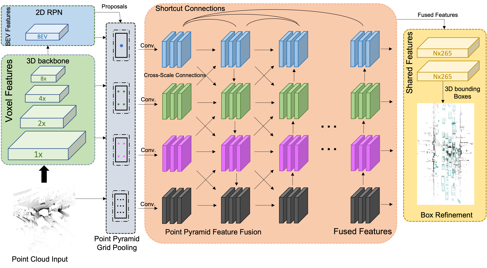

# Point Pyramid RCNN

This is a reproduced repo of 'Multi-Scale Feature Fusion with Point Pyramid for 3D Object Detection'

The code is mainly based on [OpenPCDet](https://github.com/open-mmlab/OpenPCDet).

## Introduction
We provide codes of POP-RCNN-V with 3 levels of (6,6,6) grid points and 14 layers on the KITTI dataset.  

## Acknowledgement
We would like to thank the authors of [`OpenPCDet`](https://github.com/open-mmlab/OpenPCDet) and [`PDV`](https://github.com/TRAILab/PDV) for their open source release of their codebase.

